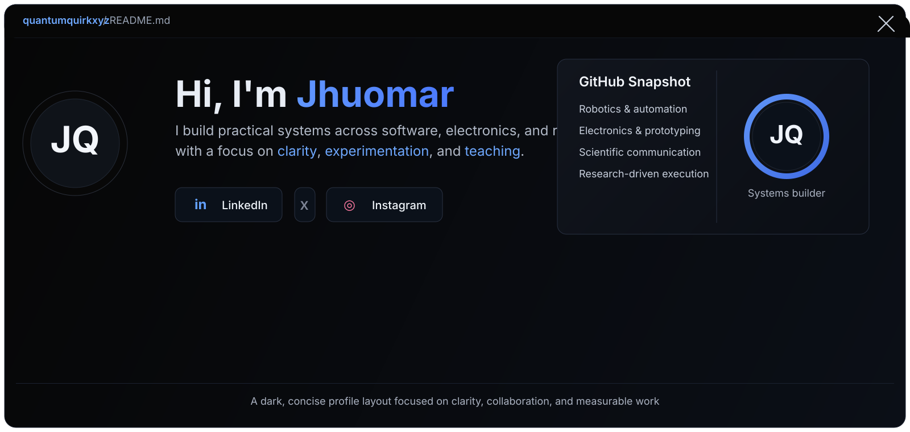

  

  
  
  

<table>
  <tr>
    <td width="68%" valign="top">
      
    </td>
    <td width="32%" valign="top">
      
       
      
    </td>
  </tr>
</table>

<table>
  <tr>
    <td width="34%" valign="top">
      <h3>What I focus on</h3>
      <ul>
        <li>Robotics, automation, and embedded systems</li>
        <li>Electronics, fabrication, and prototyping</li>
        <li>Scientific communication and education</li>
        <li>Research-driven problem solving</li>
      </ul>
    </td>
    <td width="66%" valign="top">
      <h3>Selected Stack</h3>
      

        <code>Python</code> <code>C</code> <code>C++</code> <code>Arduino</code> <code>Scratch</code>
        <code>MakeBlock</code> <code>TypeScript</code> <code>LaTeX</code> <code>FastAPI</code>
        <code>Django</code> <code>Flask</code> <code>Docker</code> <code>Supabase</code>
        <code>Postgres</code> <code>MongoDB</code> <code>TensorFlow</code> <code>PyTorch</code>
        <code>OpenCV</code> <code>Matplotlib</code>
      

    </td>
  </tr>
</table>

<table>
  <tr>
    <td width="33%" valign="top">
      
    </td>
    <td width="33%" valign="top">
      
    </td>
    <td width="33%" valign="top">
      
       
      
    </td>
  </tr>
</table>

## Featured Work

<table>
  <tr>
    <td width="33%" valign="top">
      <h4>Automation & Control</h4>
      
Practical hardware-first systems focused on reliability and measurable performance.

    </td>
    <td width="33%" valign="top">
      <h4>Education & Outreach</h4>
      
Technical content that turns complex ideas into understandable systems.

    </td>
    <td width="33%" valign="top">
      <h4>Prototyping & Design</h4>
      
Prototypes combining electronics, software, and mechanical design.

    </td>
  </tr>
</table>

More about me

I am a self-taught builder with a base in programming, mathematics, physics, and electronics.

I care about systems that are maintainable, measurable, and easy to explain. I like building with a researcher's mindset: define the problem, test assumptions, measure results, and iterate.

Outside code, I enjoy tutoring, scientific outreach, and translating technical ideas into forms that more people can use.

## Contact

If you want to collaborate on robotics, automation, education, or technical communication, reach out through LinkedIn or X.

  Built to feel more like a dashboard than a wall of text.

